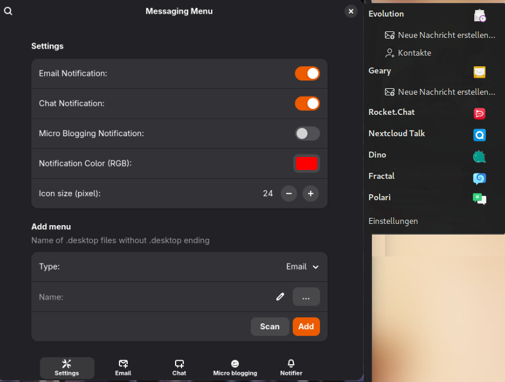

# Messaging Menu

A Messaging Menu for the Gnome Shell. All email, chat, and microblogging
applications in one place.



This extension provides a convenience list of all installed email, chat and
microblogging applications with short cut actions like "Contacts" and "Compose
New Message" for email applications. The icon lights up when you receive
notifications from the listed applications, so you won't miss another message.

The extension's preferences allow you to configure which types of applications
(email / chat / microblogging) you would like to receive notifications for and
which colour the icon should change to, to indicate notification.

Read [here](http://screenfreeze.net/messaging-menu-for-gnome-3/) for why this
extension was created.

Originally forked from https://github.com/screenfreeze/messagingmenu

## Installation

### The easy way (recommended):

[](https://extensions.gnome.org/extension/2896/messaging-menu)

### Download latest release

1. Download the zip file from the [release page](https://github.com/ChrisLauinger77/messagingmenu/releases/latest)
2. The md5 and sig files can be used to verify the integrity of the zip file
3. Unzip and run install.sh from the zip

### Install from source

Use the `master` branch.

```bash
git clone https://github.com/ChrisLauinger77/messagingmenu.git
cd messagingmenu.git
./install.sh
```

Now restart gnome-shell.

## Developing

Pull requests are welcome.

To update the translation files run ./update-translation-po-files.sh in the extensions directory after your code changes are finished. This will update the files in po folder. Then poedit (https://poedit.net/download) can be used to translate the strings. poedit can also be used to create new localization files.

# ✨️ Contributors

[](https://github.com/ChrisLauinger77/messagingmenu/graphs/contributors)
